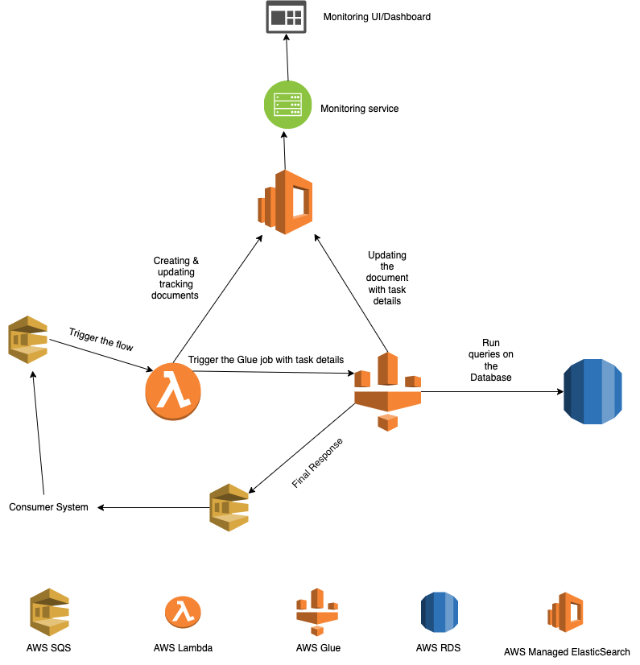

# Xeneta Operations Task Solution

These are my solutions to the cases in the task.

## Practical Case: Deployable development environment

### Technologies Used
1. I am using [**docker-compose**](docker-compose.yml) to set up a multi container development environment. Since this is a development environment we don't need a heavy setup to build & test the environment & code, using docker-compose should suffice.
2. I am using [**Dockerfile**](Dockerfile) to build an image for the application server. Using the base python3 image & copying the source code related files, I am building an image with name **backend-image** & using that to start up the application server.
3. I am using the latest postgres docker image from DockerHub. The [database dump](db/rates.sql) is automatically copied to the entrypoint of the db container.

### Code changes
1. As required I have changed the way the database configurations are read in [Flask config](rates/config.py). Now these values are read from environment variables.
2. I have created an [environment file](env/.dev.env) which has all the db configurations except for the password. This can be sourced while bringing up the environment.
3. I am not storing the db password. That needs to be exported to the local environment before bringing the environment up.

### Starting the development environment
Please make sure all the commands are run from the root of the repository.

1. Build the application server image.

> docker build . -t backend-image:latest

**Note**: If you change the docker image name or tag, please update the same in [docker compose file](docker-compose.yml).

2. Export the database password to local environment.

> export DB_PASSWORD=password

3. Start the development environment.

> docker compose --env-file ./env/.dev.env up

**Note**: The application server only starts up when the database passes a health check. Please wait for a couple of minutes for the application server to start, before moving ahead.

4. Test by making a call to the application server.

> curl "http://127.0.0.1:3000/rates?date_from=2021-01-01&date_to=2021-01-31&orig_code=CNGGZ&dest_code=EETLL"

5. Bring the system down gracefully.

> docker compose down

## Case: Data ingestion pipeline

### Architecture Diagram

### Architecture Description

1. Since the nature of traffic is sporadic I have made the system server less & event driven.
2. Since the amount of data is huge I have made the system asynchronous by using messaging queues(AWS SQS).
3. Since the system uses AWS managed services, availability & scalability are taken care of by AWS.
4. I have used a relational database(AWS RDS or any other) to maintain atomicity of updates.
5. AWS Glue has a python shell job functionality which does not have a time limit of 15 minutes like AWS Lambda which helps in running queries over database which might take a longer time.

#### Assumption
1. For the updates I have assumed since the data might be thousands of items, the Glue job might have to connect to an external service to get the data.

#### Request flow
1. The flow gets triggered by a message posted to the AWS SQS containing a request ID and details about the task. This message can be via an API call or directly by the consumer or some other system.
2. The SQS triggers a lambda function which creates a tracking document with the request ID, marks it pending, adds the task details & triggers the AWS Glue job.
3. The Glue job will read the tracking document based on request ID, mark it in progress & start the execution of the query on the Database.
4. Once the query completes(FAILS or SUCCEEDS), the glue job would mark the status of the document accordingly & add the error in the document if required. Then it would post a message(along with data retrieved in the case of read requests and error message if required) to the response SQS queue to be read by the consumer.

#### Monitoring
1. The tracking document serves the purpose of passing data between the Lambda & Glue job. But it can also be used for monitoring purposes.
2. Within the tracking document we can add statistical details of run times, data size(for read jobs), memory consumption, log location, etc.
3. This way the monitoring built over this would be able to show all those data through the dashboard / UI.
4. One added advantage of Elasticsearch is text based searching & pushing down aggregations & calculations to ES.

#### Bottle Necks
1. The resource allocation to the glue job being insufficient resulting in making the process inefficient.
2. Specifically for read requests if the size of data starts exceeding the size of messages allowed in SQS that would cause the system to fail.
3. Another potential bottleneck as the traffic grows could be breaching maximum concurrent runs limit especially for AWS Glue(as it runs for longer times).

#### Potential Solutions/Workarounds
1. The first two problems can be identified via the tracking documents & logs.
2. The DPU allocation for Glue job can be increased.
3. Instead of posting the data to response SQS we can store it in either Elasticsearch or S3, and pass on the information on how to read that via the queue.
4. On request the Glue default quotas (of max concurrent DPUs/Job runs) can be increased, if that does not work we might have to build a custom solution which creates a resource(say EC2) just to run the queries & terminates them once it is done.
5. The custom solution could be for update queries & Glue could be used for read requests.

### Additional Question
1. For the staging/development scaled down versions the biggest blocker/problem would be the concurrency limits of lambda/glue executions per account.
2. To address this we can use different AWS accounts for different environments & use appropriate Infrastructure as Code functionalities to allocate appropriate resources in different accounts.

